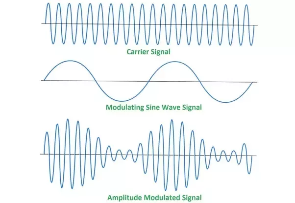
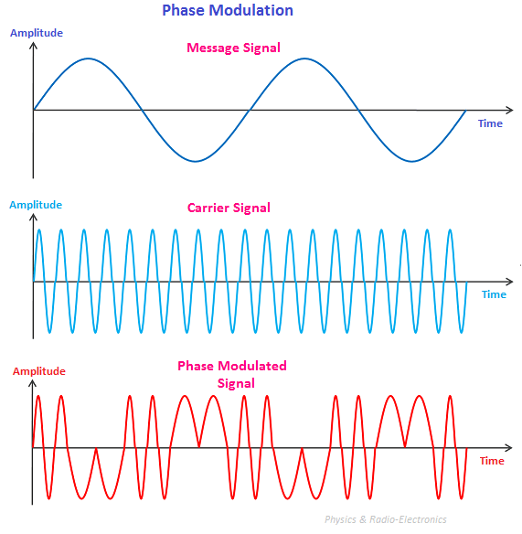
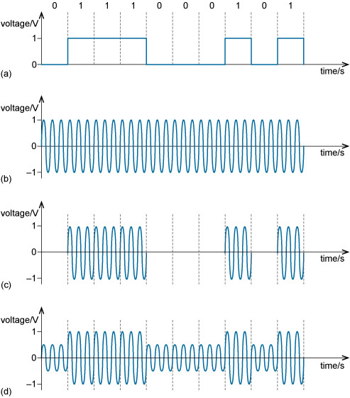
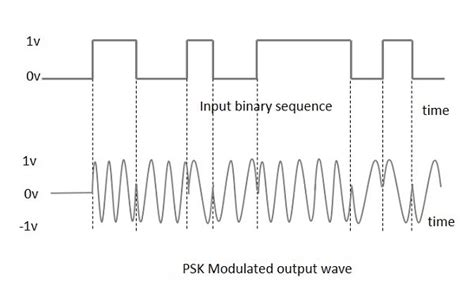
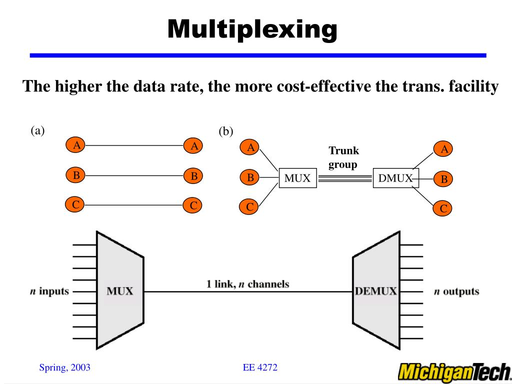
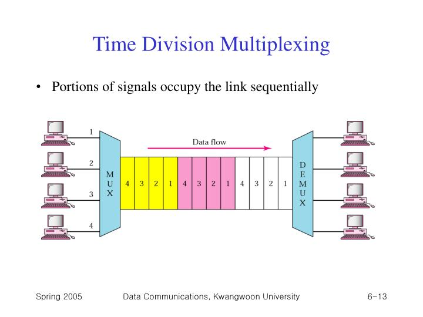

 > Vidath Dissanayake | Sri Lanka
> Links: [Computer Networking](Computer%20Networking.md)

# Modulation Techniques

Carrier waves should be used to transmit data between two locations. A carrier wave is a wave that flows through a transmission media and which is used to carry data.

Data that is available as an electronic wave should be entered into the transmission media. For that, the data available in the source of data should be connected to carrier waves. When doing so, the carrier wave or the high frequency wave should be created by changing the frequency, amplitude, and phase of the wave. This process is called modulation.

The process of modulation is divided into two portions as digital and analog due to the reason of availability of digital as well as analog data on certain occasions. 

# Analog Data Modulation

## Amplitude Modulation (AM)

Changing the height of the wave on each occasion to suit the transmitted electronic wave (data) is called amplitude modulation.

<u>Advantages:</u>
- It is very easy to modulate and demodulate.
- Low cost.

<u>Disadvantages:</u>
- May be affected by external noise during transmission.

## Frequency Modulation (FM)

The carrier wave that is created by increasing the amount of waves at locations where the voltage of the transmittable wave available in the source of data device is high and decreasing the number of wave frequency at the locations where the voltage is low is called frequency modulation.

## Phase Modulation (PM)

Creating the carrier wave by converting the wave into an angle of 180$\degree$ where the voltage of the transmitted wave is high, and creating the angle of the wave as 0$\degree$ at locations where the voltage is low is called phase modulation.

# Digital Data Modulation

The way of forwarding digital data into transmission media is called digital data transmission or digital data modulation.

There are 3 types of digital data modulation. These 3 ways are similar to analog data transmission.
1. Amplitude Shift Keying (ASK)
2. Frequency Shift Keying (FSK)
3. Phase Shift Keying (PSK)

## Amplitude Shift Keying (ASK)

The shape of the digital wave forwarded to the transmission media is created within amplitude shift keying by decreasing the height of the carrier wave in places relevant to 0 bits and increasing the height of the wave in places relevant to 1.

## Frequency Shift Keying (FSK)

The shape of the digital wave forwarded to the transmission media is created under frequency shift keying by increasing the number of waves in places relevant to '1' bits and decreasing the amount of wave in places relevant to '0' bits.

## Phase Shift Keying (PSK)

Conversion of the carrier wave into an angle of 180$\degree$ in places relevant to '1' bit and converting the same as 0$\degree$ in places relevant to 0 when forwarding data into transmission media is done in PSK.

# Multiplexing

Multiplexing combines multiple analog or digital signals bound for transmission through a single transmission line. That means, using a common transmission medium, to transmit more than 1 signal simultaneously is called as multiplexing. 

In this process, a special device is used to forward the data received through several transmission media into a single transmission media, called a multiplexer (Mux).

Suppose that 2 devices connected to a transmission media have been named device 1 and device 2 and 2 individuals are surfing the internet through those devices. The data transmitted through the computers they use are received by the multiplexer.

When the data transmitted from the two devices are received by the receiving end, they are forwarded to the de-multiplexer (DMux). Then, by that device, the data signals received from device 1 ad device 2 are separated into 2, and they are forwarded to the receiving devices.

The cost can be reduced by facilitating the signals of several devices to be flown through a single transmission media.

![[assets/images/Multiplexing.svg]]

## Frequency Division Multiplexing (FDM)

FDM is based on the concept of sharing bandwidth of a common communication channel. FDM allows few users to send their data using single communication medium without broadcasting to the air.

## Wave Division Multiplexing (WDM)

Logical division of the bandwidth of the transmission media into channels and transmit data to each device through those channels is done using wave division multiplexing. 

## Time Division Multiplexing (TDM)

According to TDM, all signals to be transmitted are not transmitted simultaneously, and they transmit one by one. Therefore, each signal will be transmitted within the transmission medium for a very short time period only.

# Data Encoding Techniques

Digital as well as analog data should be converted into signal waves to be transmitted to a different location from the device they exist. They cannot be transmitted though a media if not converted as a signal. This method of conversion is called data encoding.

## NRZ-L (Non-Return Zero Level)

Using various voltage levels of digital data bits relevant to zero and one to delineate binary numbers happens in the data encoding method of Non-Return Zero Level.

## NRZ-I (Non-Return Zero Inverted)

In this method of encoding, a physical level transmission is done at locations relevant to one. 
- That means a change of the signal at locations relevant to binary '1'. 
- There will be no change at locations relevant to '0'.

## Manchester Encoding

- In Manchester encoding, voltage changes from low to high or high to low in the middle of the signal.
- Division of the time required for transmission into similar parts and carrying out the encoding process is called Manchester encoding.
- In this process, among the similar time segment divided at locations relevant to bit 1, high and low voltages will be prepared for the 1st and 2nd time segments.

# Error Controlling

During data transmission, sometimes data bits may get flipped due to various reasons. In such situations, the data bit received is in error.

Error detection is the process of identifying that the data bit has been altered during transmission.

Error correction and recovery mechanisms are used to correct the data bits received in error and to recover the actual data.

## Parity Bit and Parity Checking

This is a simple mechanism of identifying simple errors. In this method of identifying errors, one additional bit is added when encoding transmitted data.

This bit is mentioned as parity bit. Normally when data is encoded, according to the ASCII method, it is encoded to be having 7 bits. In addition to those 7 bits, the parity bit is added. The bit used as the parity can be 0 or 1. It is decided according to the agreement of the data receiver and source before starting the process of data transmission.

### Even Parity

If the agreement is for even parity method, the number of bits relevant to data transmission with value 1 is maintained as an even number.

| Letter | Value | ASCII   | Data Being Transmitted | Parity Bit | Parity Bit With Data | No of 1's |
| ------ | ----- | ------- | ---------------------- | ---------- | -------------------- | --------- |
| C      | 67    | 1000011 | 1000011                | 1          | 11000011             | 4         |
| S      | 83    | 1010011 | 1010011                | 0          | 01010011             | 4         |

### Odd Parity

No of bits received when the ASCII value 65 of the letter A is in the table below. Encoded into binary value is, 1000001. The number of bits relevant to '1' is two (2) which is on even number. As the transmission is done on odd parity, the binary of the data being transmitted should be maintained as an odd value. Therefore, '1' is added as the parity bit.

| Letter | Value | ASCII   | Data Being Transmitted | Parity Bit | Parity Bit With Data | No of 1's |
| ------ | ----- | ------- | ---------------------- | ---------- | -------------------- | --------- |
| A      | 65    | 1000001 | 1000001                | 1          | 11000001             | 3         |
| C      | 67    | 1000011 | 1000011                | 0          | 01000011             | 3         |

