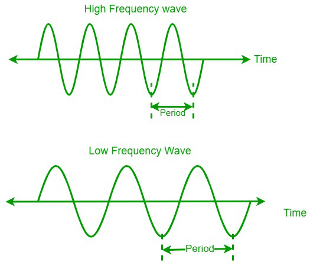
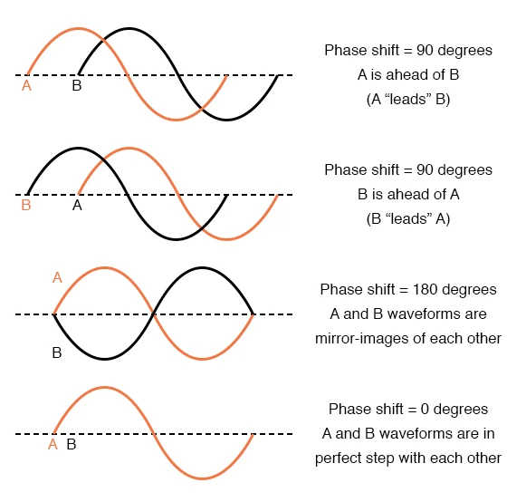
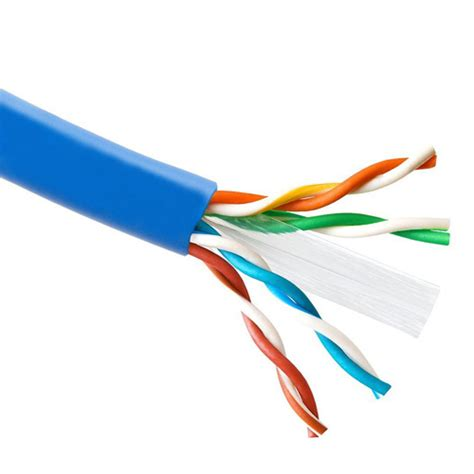
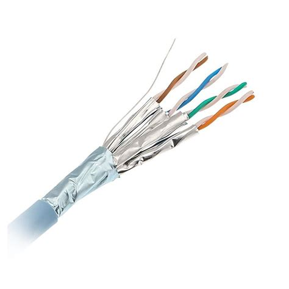
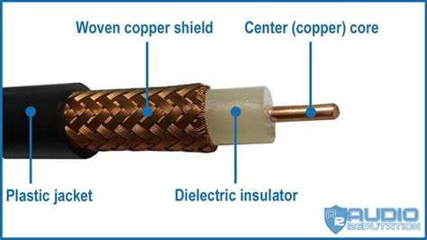

 > Vidath Dissanayake | Sri Lanka
> Links: [Computer Networking](Computer%20Networking.md)

# Analog Signals

## Advantages of Analog Signals

- A low bandwidth is used.
- The accuracy is high.

## Disadvantages of Analog Signals

- A higher cost is needed when directing to a transmission media.

# Digital Signals

## Advantages of Digital Signals

- Integrated Circuits are used to develop digital signals.
- Having the ability of multiplexing.
- Easy to analyse.
- Troubleshooting and correcting errors can easily be done in digital signals.
- Can be reproduced without changing the original signal.

## Disadvantages of Digital Signals

- Errors may occur when converting analog signals to digital signals.
- A higher bandwidth is required in transmission of digital signals.

# Properties of Signals

1. Amplitude – Height of the wave.
2. Frequency – The number of waves that passes a fixed place in the given amount of time.
   > 
3. Wave length – The distance between adjacent heads (crests) \[or troughs\] of the wave. 
4. Phase – Existence of transmission signal of a wave for a certain time.
   > 

# Baseband and Broadband Signals

| Baseband Signal                                                                                          | Broadband Signal                                                                                                         |
| -------------------------------------------------------------------------------------------------------- | ------------------------------------------------------------------------------------------------------------------------ |
| Signals created using data.                                                                              | Exists as analog signals.                                                                                                |
| Based on digital signals.                                                                                | Several of these signals that have the ability to be transmitted though a cable or radio wave.                           |
| Original frequency range of transmission of signal converted or modulated to a different frequency range | Cannot be transmitted in both directions in a single cable. Therefore, those are identified as single direction signals. |
|                                                                                                          | If we need to transmit in both directions, the cable should be split to two and transmitted accordingly.                 |

## Converting Baseband to Broadband

# Propagation Speed in a Media

Time spent to reach a certain direction through a media used to transmit data is called propagation speed in media. This speed changes according to the transmission media.

# Data Transmission Modes

There is a categorization according to the methodology of transmission of data from sender to receiver.

1. Simplex Mode – Transmitting data from sender to receiver, towards only a single direction.
    - Telecasting and broadcasting of television and radio channels.
    - 
2. Half-Duplex Mode – This as the ability to transmit data in both directions and if the data is transmitted towards a single direction at a single occasion, it is called half-duplex mode.
    - Talk via walkie-talkie.
    - 
3. Full-Duplex Mode – In full-duplex mode, data transmission occur in both directions at the same time.
    - Telephone
    - 

# Data Transmission

## Serial Data Transmission

- Data is transmitted in bits, flowing one bit after another through the transmission media is called serial data transmission.
- One wire of the transmission media is sufficient for this.
- Normally used in long distance data transmission.

## Parallel Data Transmission

- Multiple data bits transmitting over multiple channels at the same time is parallel data transmission.
- Therefore, data transmit much faster than the serial data transmission.

## Data Transmission Units

There are several units to measure data transmission. 

1. Bits per second – bps
2. Kilo bits per second – Kbps
3. Mega bits per second – Mbps

## Data Transmission Media

In data transmission, the media used to carry data from source (sender) to receiver is called data transmission media.

### Cable/Guided Media

- Guided media is using wires to transmit signals.

 #### Twisted Pair
 
 Twisted pair is consisted of a copper wire covered with a plastic cover. These wires are used in pairs, wrapped around each other. This is done to minimize electrical effects that may happen from one wire to another and to prevent mixing of the noise of the environment. 

Features:
- Low cost.
- Low bandwidth.
- When the length of the cable increases, the data transmitted becomes attenuated.
- Signal cannot travel long distances without repeaters.
- High error rate for distances greater than 100 m between 2 nodes.
- Cannot use for broadband connection network.

##### Unshielded Twisted Pair (UTP)

These cables are named as unshielded twisted pair because they are unprotected against electrical interference. It's consisted of 3 or 4 pairs of wires that have been prepared by twisting 2 wires around each other. In this, data flows though a copper wire.

##### Shielded Twisted Pair (STP)

This has been manufactured with a special cover to minimize the damage caused by external electrical signals to the data being transmitted.

This cable was first introduced by the IBM company. The speciality of this wire is that it has been covered with two plastic covers.

#### Coaxial Cable

Coaxial cables are manufactured by placing several plastic covers around the copper wire, covering with a copper mesh. These are used for external networks. The bandwidth of these cables is 10 Mbps, and they are of two types.
1. Thinnet - Flexible and size is about 0.25 inches (6.35 mm). These cables are used to connect devices within a distance of about 185 m.
2. Thicknet - It is about 0.5 inches (1.27 cm) and can transmit data to a distance of about 500 m with one segment of the cable.

BNC connectors are used when coaxial cables are used to connect a network device.

Advantages:
- Excellent cable for noise immunity.
- Can transmit signals longer distances at higher speeds. 
- Can be used for both analog and digital signals.
- These cables are inexpensive than fibre optic cables.
- Easy to install and maintain in a network.

Disadvantages:
- Expensive than twisted pair.
- Not compatible with twisted pair.

#### Fibre Optics

Thin glass or plastic threads used to transmit data using light waves is called optical fibre. LEDs or laser diodes (LDs) emit light waves at the source, which is read by a detector at the other end. Optical fibre cables has a bundle of such threads or fibres bundled together in a protecting cover. Each fibre is made up of these three layers. 

Advantages:
- High bandwidth.
- Immune to EM interference. 
- Suitable for industrial and noisy areas.
- Signals carrying data can travel long distances without weakening. 

Disadvantage:
- These cables are very expensive.
- Light waves are unidirectional, so 2 frequencies are required for full duplex transmission.

### Unguided/Wireless/Free Space Media

- Transmission of waves freely in the atmosphere without using a physical medium is known as an unguided medium.

#### Radio Waves

Radio waves are used to carry information from one physical location to another. These waves are electromagnetic and propagated by antenna. Radio waves have different frequencies.

| Name | Frequency    | Use                                            |
| ---- | ------------ | ---------------------------------------------- |
| LF   | 30-300 KHz   | AM radio                                       |
| VHF  | 30-300 MHz   | AM radio, Short range aviation communication   |
| UHF  | 300-3000 MHz | TV, Mobile phone, Wireless networks, Bluetooth |

#### Microwaves

This is an EM wave with wavelength between 0.001-0.3 m. The wavelength is smaller than radio waves and longer than UV waves. Therefore, microwaves are sometimes considered to be very short radio waves.

Places using microwaves:
- Mobile phone communication.
- Send signals to and from satellites.

Features:
- Reflected by metal surfaces.
- They heat materials if they can make atoms or molecules in the material vibrate.
- They pass though glass and plastics.
- They pass though atmosphere.
- Transmission is affected by wave effects such as reflection, refraction, diffraction, and interference. 